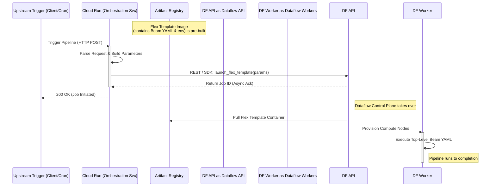

# Design Document: Cloud Run Orchestration Service for Beam YAML

## 1. Background
In our modern data platform architecture, we are adopting **Apache Beam YAML** to define Dataflow pipelines declaratively. To automate and orchestrate these pipelines dynamically, we are introducing a lightweight **Cloud Run Orchestration Service**. This service will act as the trigger mechanism, receiving upstream events (e.g., HTTP requests, Pub/Sub messages) and launching the corresponding Dataflow jobs.

## 2. Core Concepts: Sub-YAML vs. Top-Level YAML

Before designing the orchestration mechanism, it is crucial to understand the two paradigms of Beam YAML:

### 2.1 Sub-YAML (Embedded Transform)
- **Usage:** Embedded inside a traditional Python `beam.Pipeline` using `yaml_transform.YamlTransform(yaml_str)`.
- **Scope:** Acts merely as a `PTransform`. It only defines data processing steps (e.g., Read -> Map -> Write) without any global execution context.
- **Limitation:** It cannot contain pipeline-level configurations (`options:`, `runner:`, etc.). It relies entirely on the parent Python script to construct the pipeline, set up the runner, and submit the job.

### 2.2 Top-Level YAML (Standalone Pipeline)
- **Usage:** A complete pipeline specification parsed directly by `apache_beam.yaml.main`.
- **Scope:** Defines the entire lifecycle and execution environment, including `pipeline:`, `options:`, and runner configurations.
- **Limitation:** Cannot be executed via `YamlTransform(yaml_str)` directly within a Python script, as it defines its own pipeline context.

Since our orchestrator needs to trigger fully self-contained jobs based on complete configuration files, we are dealing exclusively with **Top-Level YAML**.

## 3. Technical Evaluation: Triggering Top-Level YAML from Cloud Run

To launch a Top-Level YAML job from Cloud Run, we evaluated two primary approaches:

### Option A: Dataflow Flex Template Integration (Chosen)
1. **Packaging:** The Top-Level YAML (and required Beam YAML dependencies) is pre-packaged into a Dataflow Flex Template Docker image and stored in Artifact Registry.
2. **Execution:** The Cloud Run service uses the lightweight Google Cloud Client Libraries (or REST API) to send a `projects.locations.flexTemplates.launch` request to Dataflow.
3. **Pros:** 
   - **Zero Beam Dependencies:** Cloud Run image remains ultra-lightweight. No need to install `apache-beam` (which is hundreds of MBs).
   - **Asynchronous & Decoupled:** Cloud Run simply fires an API call and exits. Dataflow handles the heavy lifting, preventing Cloud Run from timing out.
   - **Cloud-Native:** Aligns perfectly with GCP best practices for triggering Dataflow.

### Option B: Direct Subprocess / Module Execution
1. **Packaging:** The Cloud Run image includes the full `apache-beam` SDK. 
2. **Execution:** Cloud Run dynamically saves the Top-Level YAML string to a temporary file and executes it via `subprocess.run(["python", "-m", "apache_beam.yaml.main", ...])` or imports `apache_beam.yaml.main` directly in code.
3. **Cons:**
   - **Bloated Image:** Requires heavy Beam dependencies in the microservice.
   - **Resource Intensive:** Parsing and submitting the Beam DAG consumes Cloud Run memory/CPU, increasing the risk of Out-Of-Memory (OOM) errors.
   - **Tight Coupling:** Blurs the line between orchestration logic and job submission logic.

## 4. Architecture Decision

We have explicitly chosen **Option A (Flex Template Integration)**. It ensures our Cloud Run service remains a highly responsive, stateless orchestration layer, offloading all Beam/Dataflow heavy lifting to the GCP Dataflow control plane.

## 5. System Flow (Mermaid)

The following sequence diagram illustrates the chosen architecture (Option A):

