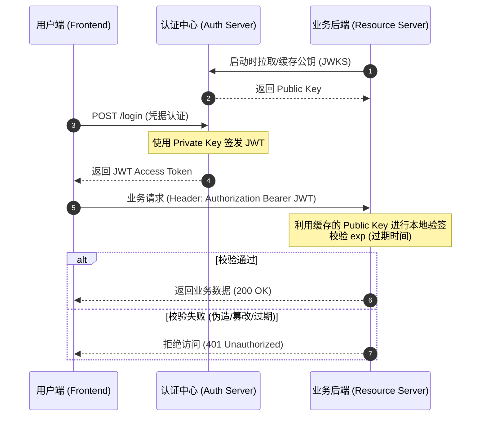

# 深度解析 JWT：分布式架构下的鉴权博弈与防伪逻辑

在分布式与微服务架构中，状态的集中管理往往成为系统的性能瓶颈。JWT (JSON Web Token) 的引入，本质上是将集中式的鉴权状态下放，通过密码学手段实现“去中心化”的身份信任。本文将从底层签名机制切入，剥离表象，探讨 JWT 在实际业务链路中的设计抉择。

## 1. 结构解剖与客户端透明性

JWT 的标准结构由 `.` 分隔的三段式构成：`Header.Payload.Signature`。

必须明确的工程常识是：前两段（Header 与 Payload）仅采用 Base64Url 编码，**并未加密**。这意味着 JWT 对客户端（前端/App）是完全透明的。客户端可以自行解码 Payload 提取 `user_id` 或 `exp`，但受限于密码学防伪机制，客户端无法篡改数据，更无法凭空捏造合法 Token。敏感数据（如密码、内部金融流水号）严禁封装于 Payload 中。

## 2. 核心防伪：签名与校验的密码学原理

JWT 的信任基础建立在 Signature（签名）之上。根据业务架构的复杂度，签名方案主要分为两类：

### 2.1 对称加密架构 (如 HS256)
签发与校验共享同一密钥（Secret Key）。
- **逻辑**：服务端接收到 Token 后，提取 Header 与 Payload，利用本地存储的 Secret Key 重新计算签名。若计算结果与 Token 附带的签名一致，则校验通过。
- **局限**：在微服务矩阵中，所有需要验签的下游业务服务都必须持有该 Secret Key。密钥泄露的风险随节点增加呈指数级上升。

### 2.2 非对称加密架构 (如 RS256)
现代企业微服务矩阵的标准解法。签发与校验职责严格分离。
- **签发**：认证中心（Auth Server）独占**私钥 (Private Key)**，以此生成不可伪造的签名。私钥绝不参与任何网络传输。
- **校验**：业务资源服务（Resource Server）通过请求认证中心公开的 JWKS (JSON Web Key Set) 端点，获取**公钥 (Public Key)**。公钥唯一的作用是通过反向数学运算，验证签名是否由对应私钥签发。验证过程不涉及“重新生成签名”。

## 3. 端到端 (E2E) 鉴权链路流转

以下为基于非对称加密 (RS256) 的微服务标准鉴权拓扑图：

## 4. 架构反思：Token Introspection 机制的妥协

JWT 的最大架构痛点在于“状态剥离”带来的副作用：Token 在过期前极难被服务器主动撤销。

为解决此安全隐患，部分架构设计引入了 Token Introspection (RFC 7662) 机制。即业务后端放弃本地公钥验签，转而通过内部 API 将 Token 透传回认证中心进行实时合法性问询。

此方案虽实现了秒级 Token 撤销，但属于典型的架构退化（Architecture Degradation）：
1. **性能损耗**：鉴权由毫秒级的本地 CPU 计算，降级为跨服务网络 I/O。
2. **去中心化失效**：认证中心重新成为系统单点瓶颈。
3. **语义悖论**：既然依赖中心化 API 校验真伪，JWT 的自包含特性便失去意义，不如直接降级为 Opaque Token（不透明的随机字符串）配合 Session 机制使用。

在架构设计中，安全与性能永远是 Trade-off。追求极致解耦的系统应坚守 JWT 的本地公钥验签，配合短过期时间（Short Expiration）与 Refresh Token 机制来对冲安全风险。